# Eltex Social Media
<a name="up"></a>

---

**The project is written in the [Kotlin](https://kotlinlang.org) programming language**

Educational project Development of Android applications in Java and Kotlin from Eltex Academy.
This project is based on the **MVVM** architecture **(Model-View-ViewModel)**.
The **MVI** (Model-View-Intent) architecture is used to process and download data from the server.

The project implements working with the server to perform **CRUD** operations (Create, Read, Update, Delete) with posts and events.
The [**Retrofit2**](https://github.com/square/retrofit) library is used to interact with the server along with [**Coroutines**](https://github.com/Kotlin/kotlinx.coroutines ), which allows asynchronous requests to be executed without blocking the main thread.
To implement the [**DI Dependency Injection**](https://developer.android.com/training/dependency-injection), the [**Dagger2-Hill**](https://developer.android.com/training/dependency-injection/hilt-android) library and the Singleton antipattern removal **Factory** are used.

To work with the local database **SQLite**, **[ORM ROOM](https://developer.android.com/training/data-storage/room)** is used together with **[ksp](https://developer.android.com/jetpack/androidx/releases/room)**.
**[The Prepopulate your Room database](https://developer.android.com/training/data-storage/room/prepopulate)** is used in the project for convenient testing.
Using **[Jetpack Preferences DataStore](https://developer.android.com/topic/libraries/architecture/datastore)** to work with local files on the device.

To work with requests to the server and process the received data in JSON format, the **[Retrofit2](https://github.com/square/retrofit)** and **[OkHttp3](https://github.com/square/okhttp)** libraries from **[Square](https://github.com/square)** + **[RxJava3](https://github.com/ReactiveX/RxJava)** from **[ReactiveX](https://github.com/ReactiveX)** are used to implement reactive programming, instead of accumulating Callbacks. The project has been rewritten from reactive programming on **[Retrofit2](https://github.com/square/retrofit)** + **[RxJava3](https://github.com/ReactiveX/RxJava)** to standard **[Retrofit2](https://github.com/square/retrofit)** + **[Coroutines](https://github.com/Kotlin/kotlinx.coroutines)** (suspend).

The project uses several types of architecture patterns and paradigms: **DI Dependency Injection**, **Builder**, **Observable**, **Observer**, **Adapter**, **Dependency Injection**, **Single Activity Architecture**, **Modular Architecture**, **Reactive Programming** and **Factory**.

To animate the loading of a list of posts or events in the **UI**, the [**SkeletonLayout**](https://github.com/Faltenreich/SkeletonLayout) library is used: displaying skeletons during initial loading and loading of the next page.
The [**Glide**](https://github.com/bumptech/glide) library is used to manage multimedia and download images from the server for display in the **UI**.

Basic settings for the application's appearance are implemented, such as: language selection (Russian, English, system) and theme selection (dark, light, system). The ability to enable and disable vibration feedback in the application, display the size and clear the application cache has also been added.

#### Documentation for the project [**documentation**](documentation/documentation.md).
#### View images of the mobile app [Eltex Academy](#images)

[](https://www.gnu.org/licenses/agpl-3.0)
[](https://github.com/LebedevSergeyVach/EltexSocialMedia/releases/tag/v1.0.1)

<details open="open">
    <summary><h2>🚀 The stack of technologies used</h2></summary>

| [](https://kotlinlang.org/) | [](https://github.com/square/retrofit) | [](https://github.com/ReactiveX/RxJava) | [](https://github.com/bumptech/glide) | [](https://github.com/Faltenreich/SkeletonLayout) | [](https://developer.android.com/jetpack) | [](https://gradle.org/) |
|:----------------------------------------------------------------------------------------------------------------------------------------------------------:|:----------------------------------------------------------------------------------------------------------------------------------------------------------------------------------------:|:--------------------------------------------------------------------------------------------------------------------------------------------:|:----------------------------------------------------------------------------------------------------------------------------------------------------------------:|:-------------------------------------------------------------------------------------------------------------------------------------------------------------------------------------------------------------:|:--------------------------------------------------------------------------------------------------------------------------------------------------------------------------------------:|:------------------------------------------------------------------------------------------------------------------------------------------------------:|
|                                                                           Kotlin                                                                           |                                                                                         Retrofit                                                                                         |                                                                    RxJava                                                                    |                                                                              Glide                                                                               |                                                                                                SkeletonLayout                                                                                                 |                                                                                    AndroidX Jetpack                                                                                    |                                                                         Gradle                                                                         |

</details>

---

> [!IMPORTANT]
> ## **Project Description**
>
> An educational project for the development of Android applications in Java and Kotlin from Eltex Academy.
> The application is a social network that will allow users to create posts and events, indicate their places of work and much more.

> [!NOTE]
> ## **Features and functionality of the application**
>
> ### **Posts**
> - Create, edit, and delete posts:
> - - Write a text for a new post.
> - - Attach an image to a new post.
> - - Edit or delete an existing post.
> - Watch the feed of posts from all users.
> - Please like the post.
>
> ### **Events**
> - Create, edit, and delete events:
> - - Write a text for a new event.
> - - Choose the date and time for the event.
> - - Attach a link or an address for the event.
> - - Attach an image to a new event.
> - - Edit or delete existing events.
> - Watch the feed of events from all users.
> - Please likes and participate in the event.
>
> ### **Account**
> - Registering a new account:
> - - Specify the username, name, and avatar for your account.
> - Manage your posts, events, and work/study information.
>
> ### **Profile**
> - View the profile of other users.
> - View all the posted information from the user.
> - See the list of all users of the application.
>
> ### **Information about places of work**
> - Create new information about your place of work/study:
> - - Please provide information about the company: the name, your position, the reference and the period of employment.
> - See other users' places of work/study.
>
> ### **Settings**
> - Choose an application theme:
> - - Light.
> - - Dark .
> - - System.
> - Choose the application language:
> - - English.
> - - Russian.
> - - System (may not work well on some devices).
> - Turn on and off the vibration response in the app.
> - Keep track of the cache size and also clear it in the application.
> - Keep an eye on all app updates.
>
> ### **The project is under active development!**
>
> Application version 1.0.0
> At the moment, work is underway to improve the functionality of the application, add new features to the project, as well as solve possible problems and bugs.
>
> ### Further development plans:
> - Add features to the app for working with voice posts/events and videos.
> - Improve caching of data downloaded from the server.
> - Implement a fragment displaying data about a post/event:
> - - Displaying information about a post/event;
> - - Users who liked/participated;
> - - Comments;
> - - Displaying the location/event on the map;
> - - Mentioning other users when creating a post/event.
>
> ### Project development assistance:
> - If you find a bug or have an idea for improvement, please create [**issue**](https://github.com/LebedevSergeyVach/EltexSocialMedia/issues).
> - You can also suggest your changes or implement new features/functions via [**pull request**](https://github.com/LebedevSergeyVach/EltexSocialMedia/pulls).

> [!WARNING]
> ### **Compilation of the project**
>
> In order to build a project, you need to create **`secrets.properties`** in the root of the project:
>
>```properties
>    API_KEY="The key to access the server" Name: Authorization (apiKey) String
>    URL_SERVER="the URL of the connected server" String
>```

---

### [Anatoly Spitchenko](https://gitflic.ru/user/onotole) - Android developer and Course Teacher

### [Lebedev Sergey Vyacheslav](https://github.com/LebedevSergeyVach) – Kotlin-Developer

---

#### [README](README.md) [UP](#up)

---

# Социальная сеть Eltex
<a name="вверх"></a>

---

**Проект написан на языке программирования [Kotlin](https://kotlinlang.org).**

Образовательный проект по разработке Android-приложений на Java и Kotlin от Eltex Academy.
Данный проект основан по архитектуре **MVVM** **(Model-View-ViewModel)**.
Для обработки и загрузки данных с сервера используется архитектура **MVI** (Model-View-Intent).

В проекте реализована работа с сервером для выполнения операций **CRUD** (Create, Read, Update, Delete) с постами и событиями.
Для взаимодействия с сервером используется библиотека [**Retrofit2**](https://github.com/square/retrofit) вместе с [**Coroutines**](https://github.com/Kotlin/kotlinx.coroutines), что позволяет выполнять асинхронные запросы без блокировки основного потока.
Для реализации [**Внедрение зависимостей DI**](https://developer.android.com/training/dependency-injection) используется библиотека [**Dagger2-Hill**](https://developer.android.com/training/dependency-injection/hilt-android) и паттерн **Фабрика** для удаления антипаттерн **Singleton**.

Для работы с локальной базой данных **SQLite** используется **[ORM ROOM](https://developer.android.com/training/data-storage/room)** вместе с **[ksp](https://developer.android.com/jetpack/androidx/releases/room)**.
**[The Prepopulate your Room database](https://developer.android.com/training/data-storage/room/prepopulate)** используется в проекте для удобства тестирования.
Используется **[Jetpack Preferences DataStore](https://developer.android.com/topic/libraries/architecture/datastore)** для работы с локальными файлами на устройстве.

Для работы с запросами на сервер и обработкой полученных данных в формате JSON используется библиотеки **[Retrofit2](https://github.com/square/retrofit)** и **[OkHttp3](https://github.com/square/okhttp)** от **[Square](https://github.com/square)** + **[RxJava3](https://github.com/ReactiveX/RxJava)** от **[ReactiveX](https://github.com/ReactiveX)** для реализации реактивного программировая, вместо накапливающихся Callback - ов. Проект переписан с реактивного программирования на **[Retrofit2](https://github.com/square/retrofit)** + **[RxJava3](https://github.com/ReactiveX/RxJava)** на стандартные **[Retrofit2](https://github.com/square/retrofit)** + **[Coroutines](https://github.com/Kotlin/kotlinx.coroutines)** (suspend).

В проекте используется несколько типов архитектурных паттернов и парадигм: **DI Внедрение зависимостей**, **Строитель**, **Наблюдаемый**, **Наблюдатель**, **Адаптер**, **Внедрение зависимостей**, **Архитектура с одной активностью**, **Модульная архитектура**, **Реактивное программирование** и **Фабрика**.

Для анимации загрузки в **UI** списка данных постов или событий используется библиотека [**SkeletonLayout**](https://github.com/Faltenreich/SkeletonLayout): отображение скелетонов при начальной загрузке и загрузке следующей страницы.
Для управления мультимедиа и загрузки изображений с сервера для отображения в **UI** используется библиотека [**Glide**](https://github.com/bumptech/glide).

Реализованы базовые настройки внешнего вида приложения, такие как: выбор языка (Русский, Английский, системный) и выбор темы (темная, светлая, системная). Также добавлена возможность включения и отключения виброотклика в приложении, показ размера и очистка кэша приложения.

#### Документация к проеку [**documentation**](documentation/documentation.md).
#### Посмотреть изображения мобильного приложения [Eltex Academy](#images)

[](https://www.gnu.org/licenses/agpl-3.0)
[](https://github.com/LebedevSergeyVach/EltexSocialMedia/releases/tag/v1.0.1)

<details open="open">
    <summary><h2>🚀 Стек используемых технологий</h2></summary>

| [](https://kotlinlang.org/) | [](https://github.com/square/retrofit) | [](https://github.com/ReactiveX/RxJava) | [](https://github.com/bumptech/glide) | [](https://github.com/Faltenreich/SkeletonLayout) | [](https://developer.android.com/jetpack) | [](https://gradle.org/) |
|:----------------------------------------------------------------------------------------------------------------------------------------------------------:|:----------------------------------------------------------------------------------------------------------------------------------------------------------------------------------------:|:--------------------------------------------------------------------------------------------------------------------------------------------:|:----------------------------------------------------------------------------------------------------------------------------------------------------------------:|:-------------------------------------------------------------------------------------------------------------------------------------------------------------------------------------------------------------:|:--------------------------------------------------------------------------------------------------------------------------------------------------------------------------------------:|:------------------------------------------------------------------------------------------------------------------------------------------------------:|
|                                                                           Kotlin                                                                           |                                                                                         Retrofit                                                                                         |                                                                    RxJava                                                                    |                                                                              Glide                                                                               |                                                                                                SkeletonLayout                                                                                                 |                                                                                    AndroidX Jetpack                                                                                    |                                                                         Gradle                                                                         |

</details>

---

> [!IMPORTANT]
> ## **Описание приложения**
>
> Образовательный проект по разработке Android-приложений на Java и Kotlin от Eltex Academy.
> Приложение представляет собой социальную сеть, которая позволит пользователям создавать посты и события, указывать места своей работы и многое другое.

> [!NOTE]
> ## **Возможности и функционал приложения**
>
> ### **Посты**
> - Создавайте, редактируйте и удаляйте посты:
> - - Пишите текст для нового поста.
> - - Прикрепляйте  изображение к новому посту.
> - - Редактируйте  или удаляйте существующий пост.
> - Смотрите ленту постов от всех пользователей.
> - Ставьте лайк посту.
>
> ### **События**
> - Создавайте, редактируйте и удаляйте события:
> - - Пишите текст для нового события.
> - - Выбирайте дату и время для проводимого события.
> - - Прикрепляйте ссылку или адрес для проводимого события.
> - - Прикрепляйте  изображение к новому событию.
> - - Редактируйте или удаляйте существующие событие.
> - Смотрите ленту событий от всех пользователей.
> - Ставьте лайки и участвуйте в мероприятии.
>
> ### **Аккаунт**
> - Регистрируете новый аккаунт:
> - - Указывайте логин, имя и аватар для Вашего аккаунта.
> - Управляйте своими постами, событиями и информации о работе/учебе.
>
> ### **Профиль**
> - Просматривайте профиль других пользователей.
> - Просматривайте всю выложенную информацию от пользователя.
> - Смотрите список всех пользователей приложения.
>
> ### **Информация о местах работы**
> - Создавайте новую информацию о месте Вашей работы/учебы:
> - - Указывайте информацию о компании: название, Ваша должность, ссылка и промежуток трудоустройства.
> - Смотрите места работы/учебы у других пользователей.
>
> ### **Настройки**
> - Выбирайте тему приложения:
> - - Светлая.
> - - Темная.
> - - Системная.
> - Выбирайте язык приложения:
> - - Русский.
> - - Английский.
> - - Системный (может плохо работать на некоторых устройствах).
> - Включайте и отключайте виброотклик в приложении.
> - Следите за размером кэша, а также очищайте его в приложении.
> - Смотрите за всеми обновлениями приложения.
>
> ### **Проект находится в стадии активной разработки!**
>
> Версия приложения 1.0.0
> На данный момент идет работа над улучшением функциональности приложения, добавления новых фишек в проект, а также решение возможных проблем и багов.
>
> ### Планы дальнейшего развития:
> - Добавить функции в приложение по работе с голосовыми постами/события и видео.
> - Улучшить кэширование данных, загруженных с сервера.
> - Реализовать фрагмент с отображением данных о посте/событии:
> - - Отображение информации о посте/событии;
> - - Пользователи, поставившие лайк/участие;
> - - Комментарии;
> - - Отображение места/проведения события на карте;
> - - Упоминание других пользователей при создании поста/события.
>
> ### Помощь в развитии проекта:
> - Если Вы нашли баг или у вас есть идея для улучшения, пожалуйста, создайте [**issue**](https://github.com/LebedevSergeyVach/EltexSocialMedia/issues).
> - Вы также можете предложить свои изменения или реализацию новых фишек/функций через [**pull request**](https://github.com/LebedevSergeyVach/EltexSocialMedia/pulls).

> [!WARNING]
> ### **Компиляция проекта**
>
> Для того, чтобы собрать проект, необходимо создать **`secrets.properties`** в корне проект:
>
>```properties
>    API_KEY="Ключ для доступа к серверу" Name: Authorization (apiKey) String
>    URL_SERVER="URL подключаемого сервера" String
>```

---

### [Анатолий Спитченко](https://gitflic.ru/user/onotole) - Android-Разработчик и преподаватель курса

### [Лебедев Сергей Вячеславович](https://github.com/LebedevSergeyVach) – Kotlin-Разработчик

---

#### [README](README.md) [ВВЕРХ](#вверх)

---

<a name="images"></a>
## Images mobile application of the [**Eltex Social Media**](https://github.com/LebedevSergeyVach/EltexSocialMedia/)

### Authorization and Registration / Авторизация и Регистрация

<div style="display: flex; justify-content: space-between; align-items: center;">
  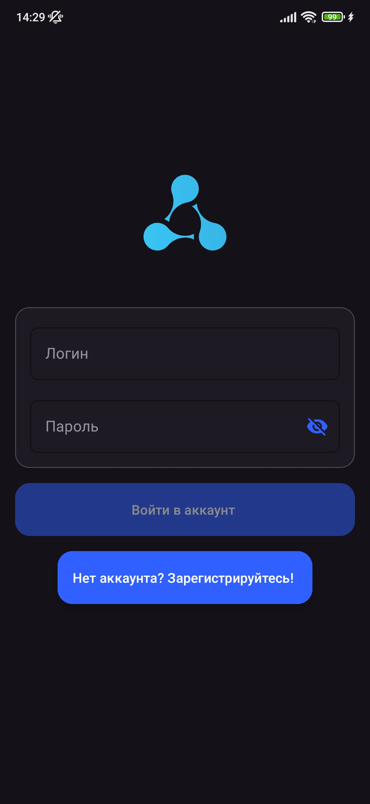
  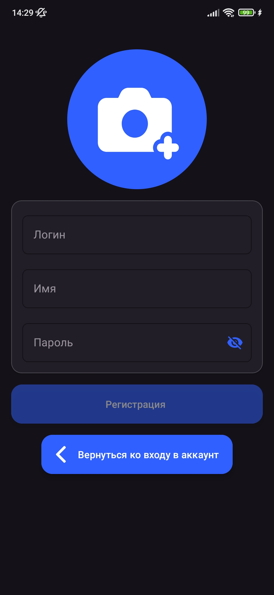
  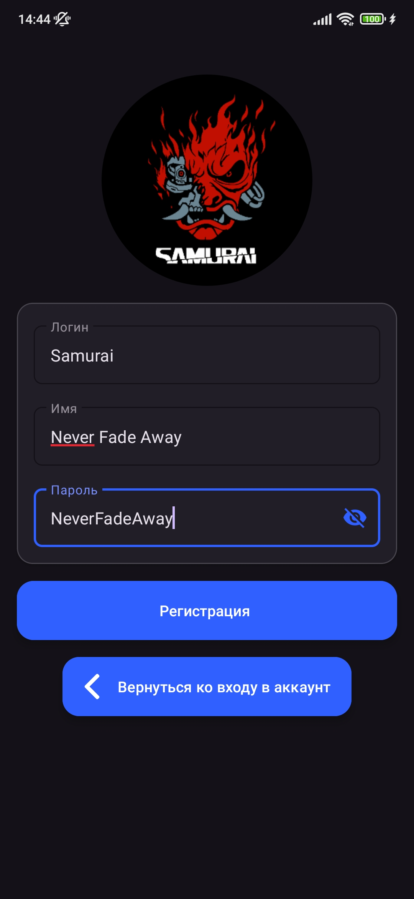
</div>

### Posts / Посты

<div style="display: flex; justify-content: space-between; align-items: center;">
  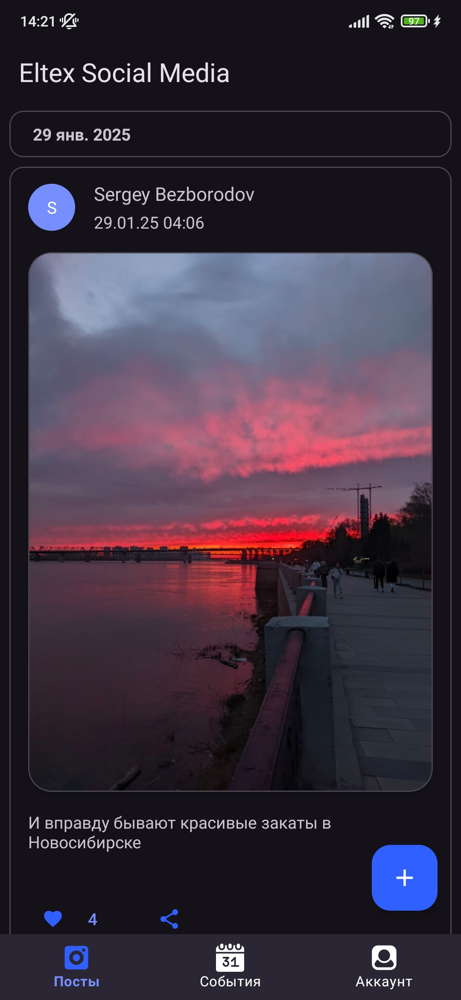
  
  
</div>

### Events / События

<div style="display: flex; justify-content: space-between; align-items: center;">
  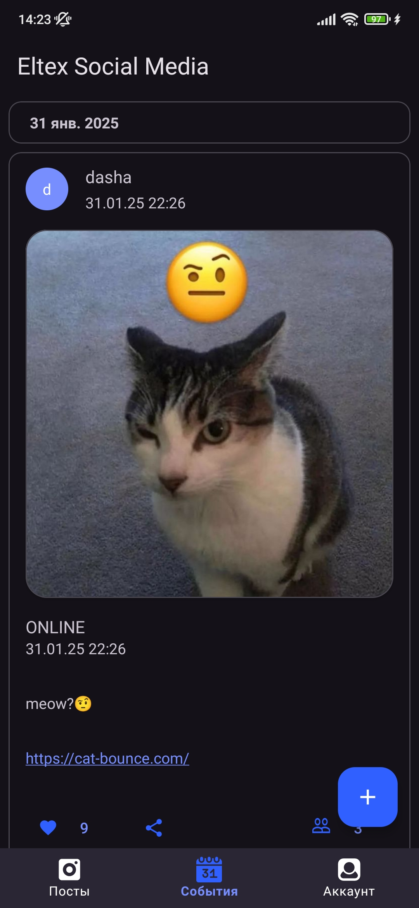
  
  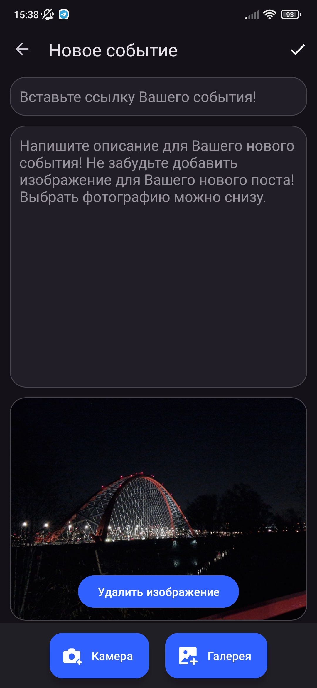
</div>

### Account / Аккаунт

<div style="display: flex; justify-content: space-between; align-items: center;">
  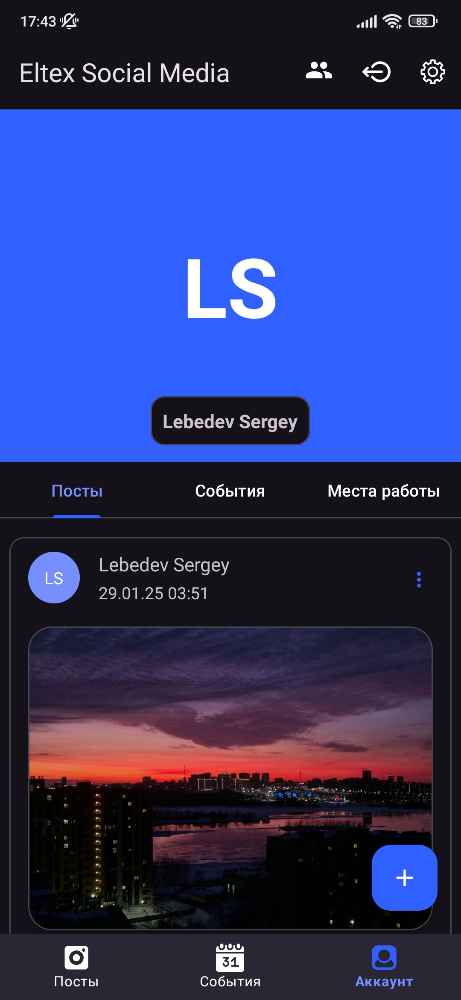
  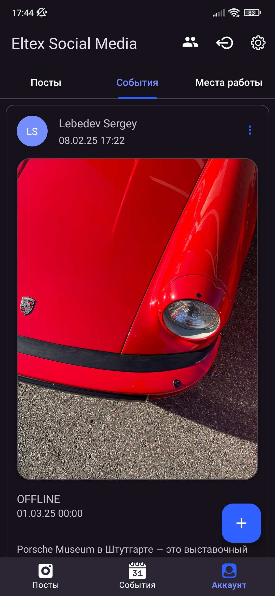
  
</div>

### Profile / Профиль

<div style="display: flex; justify-content: space-between; align-items: center;">
  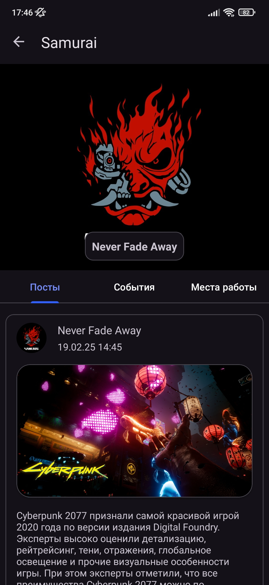
  
  
</div>

### Jobs / Места работы

<div style="display: flex; justify-content: space-between; align-items: center;">
  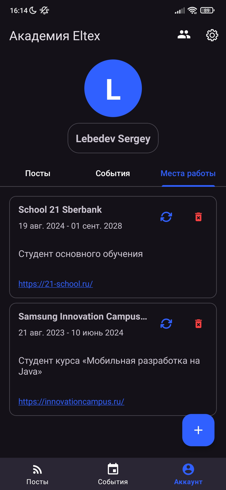
  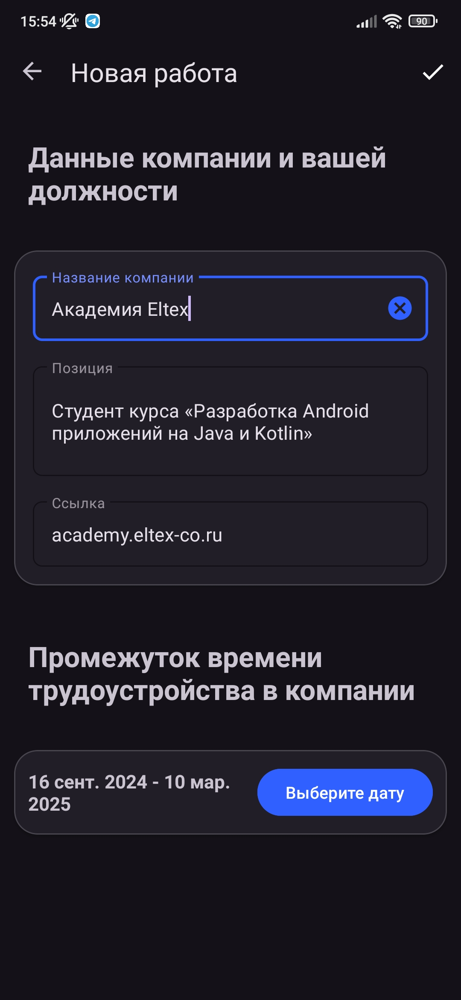
  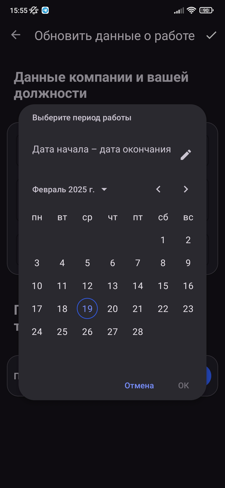
</div>

### Settings / Настройки

<div style="display: flex; justify-content: space-between; align-items: center;">
  
  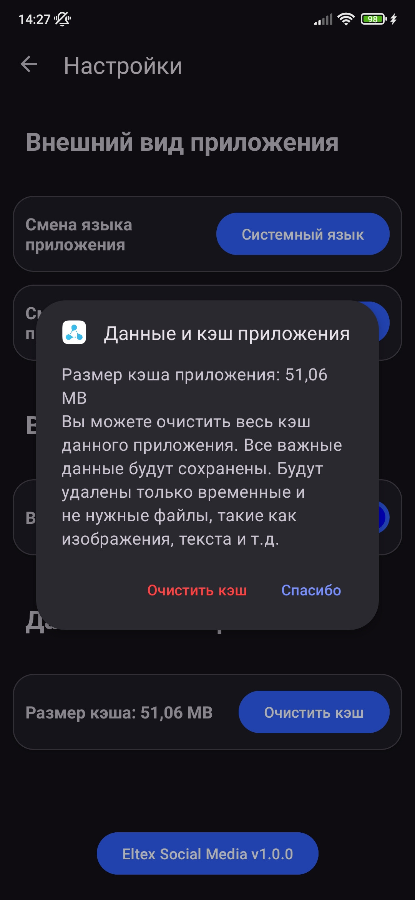
  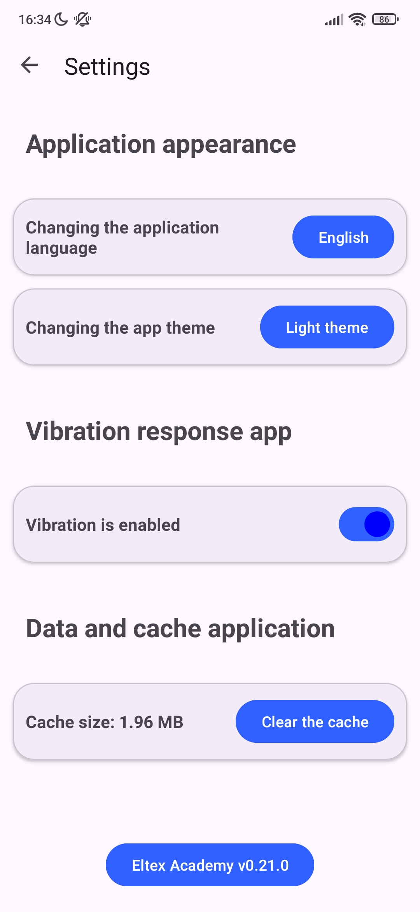
</div>

### Users and List of updates / Пользователи и Список обновлений

<div style="display: flex; justify-content: space-between; align-items: center;">
  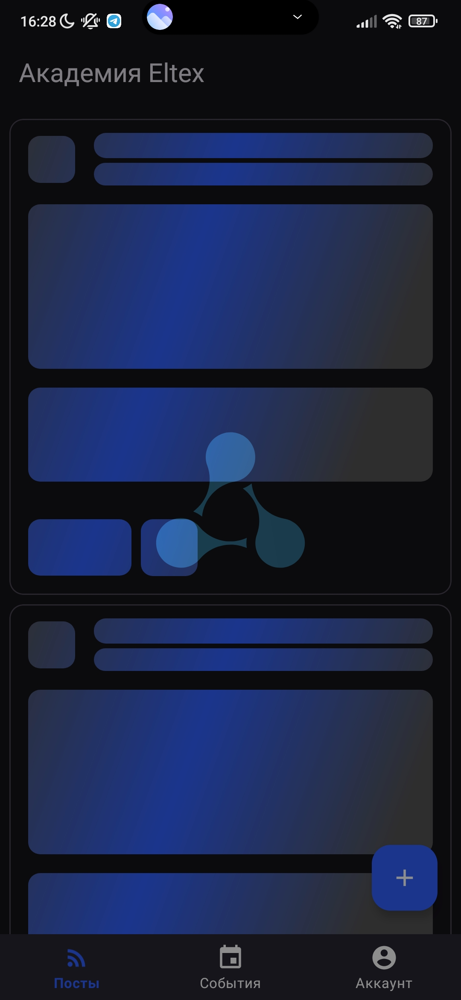
  
  
</div>

### Loading animation / Анимация загрузки

<div style="display: flex; justify-content: space-between; align-items: center;">
  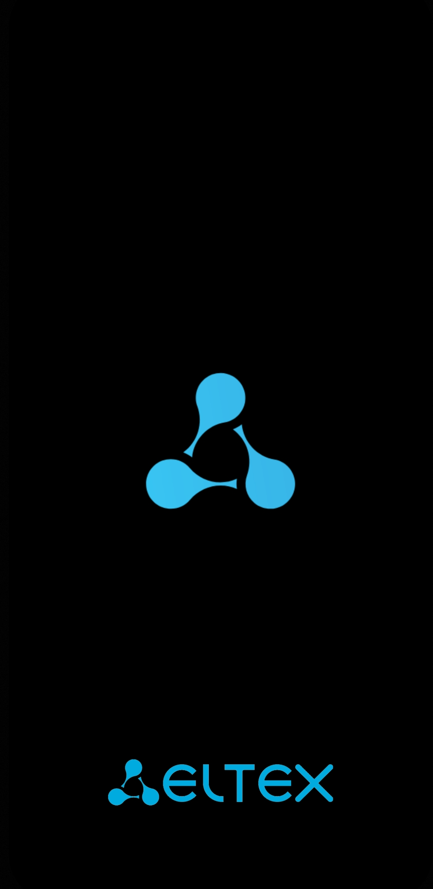
  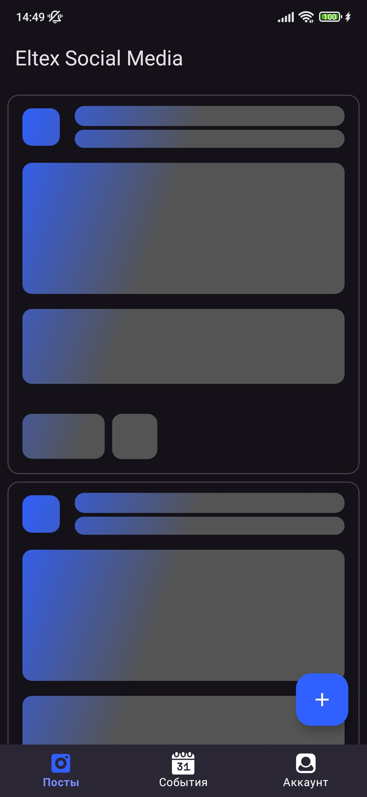
  
</div>

---
