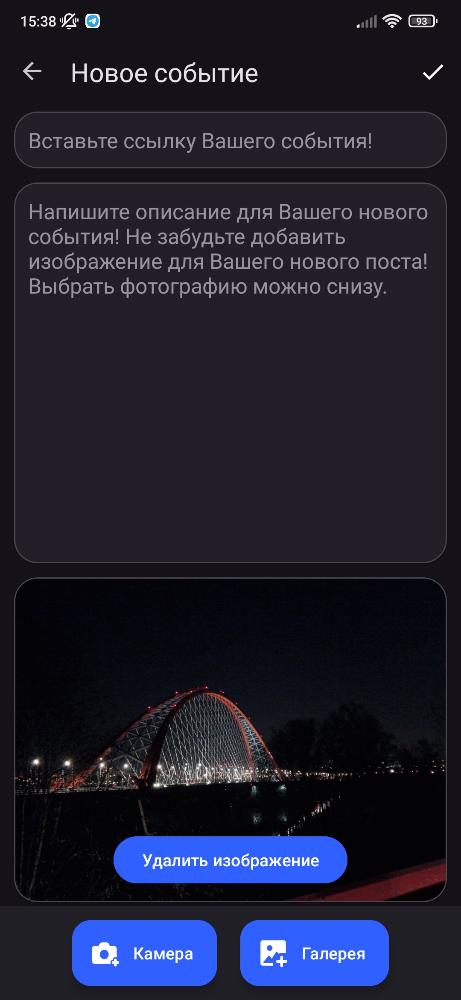
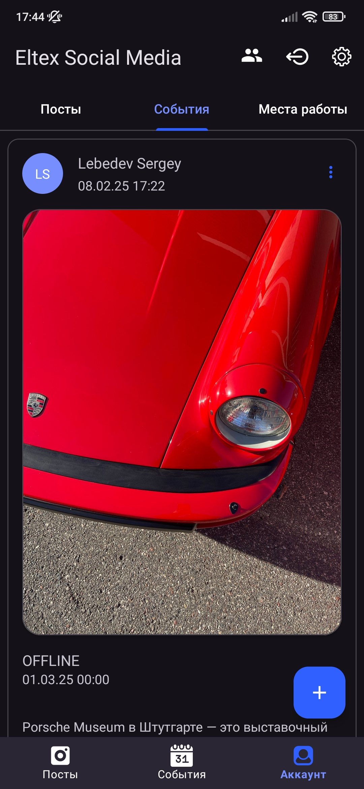
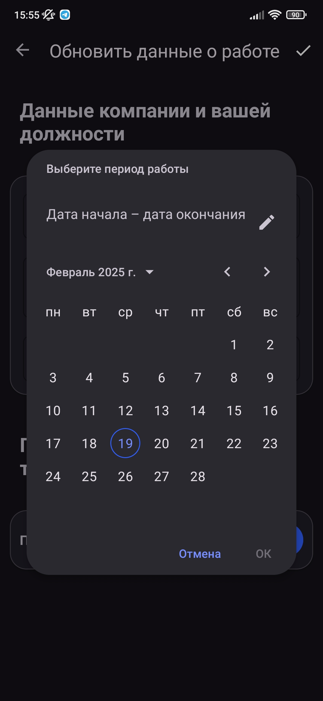
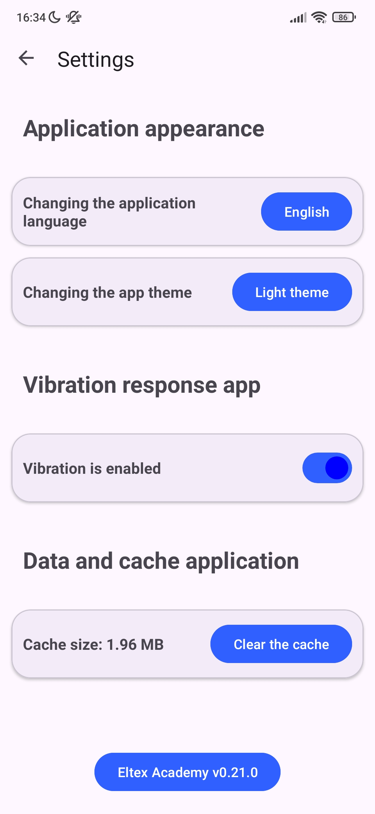
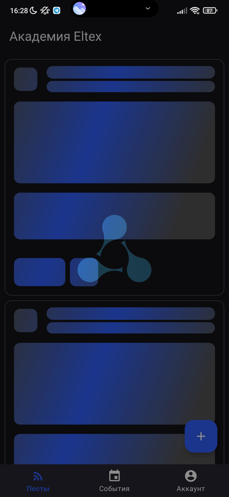
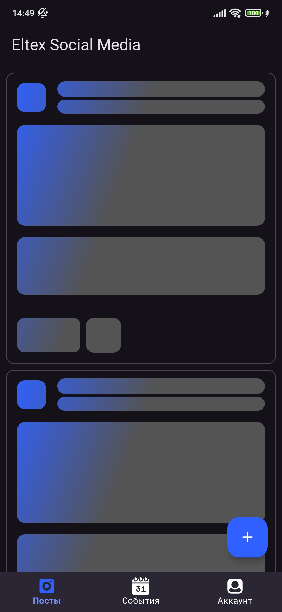

# Screenshots of the mobile app / Скриншоты мобильного приложения [**Eltex Social Media**](https://github.com/LebedevSergeyVach/EltexSocialMedia/)

---

## Authorization and Registration / Авторизация и Регистрация

  
  
  

## Posts / Посты

  
  
  

## Events / События

  
  
  

## Account / Аккаунт

  
  
  

## Profile / Профиль

  
  
  

## Jobs / Места работы

  
  
  

## Settings / Настройки

  
  
  

## Users and List of updates / Пользователи и Список обновлений

  
  
  

## Loading animation / Анимация загрузки

  
  
  

---

#### [README](README.md) [UP/ВВЕРХ](#up)
